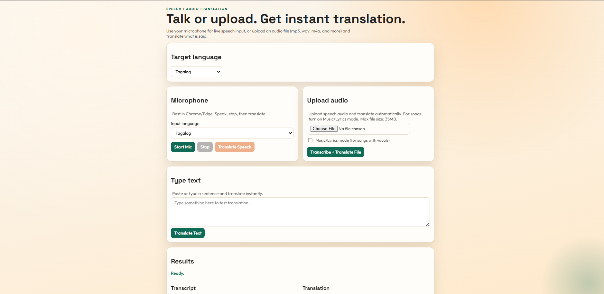

# Translator App

A web-based translator that supports:

- Microphone speech input
- Audio file upload transcription + translation
- Direct text translation
- Tagalog to Ilokano shortcut translation
- Text-to-speech playback of translated output (via TTS.ai)

## Features

- Speech recognition in browser (Chrome/Edge)
- Audio upload (`audio/*`) with configurable behavior for music/lyrics mode
- Translation to multiple target languages
- Dedicated endpoint for Tagalog to Ilokano
- Generated voice playback for translated text
- File upload size validation (35MB max)

## Tech Stack

- Node.js + Express
- AssemblyAI (audio transcription)
- Google Translate endpoint (text translation)
- TTS.ai API (voice output)
- Vanilla HTML/CSS/JS frontend

## Project Structure

```text
translator.js
src/
	app.js
	modules/
		language.js
		transcriptionService.js
		translationService.js
		ttsService.js
public/
	index.html
	app.js
	styles.css
assets/
	Translation-favicon-img.svg
```

## Requirements

- Node.js 18+
- API keys:
  - AssemblyAI
  - TTS.ai

## Installation

```bash
npm install
```

## Environment Variables

Create or edit `.env`:

```env
ASSEMBLYAI_API_KEY="your_assemblyai_key"
TTS_AI_API_KEY="your_tts_ai_key"
PORT=3000
```

## Run

```bash
npm start
```

Open:

`http://localhost:3000`

## Main API Endpoints

- `POST /api/translate`
  - Translate plain text.
- `POST /api/transcribe-and-translate`
  - Upload audio + transcribe + translate.
- `POST /api/tagalog-to-ilokano`
  - Quick Tagalog to Ilokano translation.
- `POST /api/tts`
  - Convert translated text to audio (MP3).

## Notes

- Upload max file size is 35MB.
- For songs with vocals, use Music/Lyrics mode in the upload section.
- If speech playback fails, verify `TTS_AI_API_KEY` and ensure your account has available credits.

## Security

- Do not commit real API keys.
- Rotate keys if they were accidentally exposed.

## License

This project is licensed under the MIT License. See the `LICENSE` file for details.
